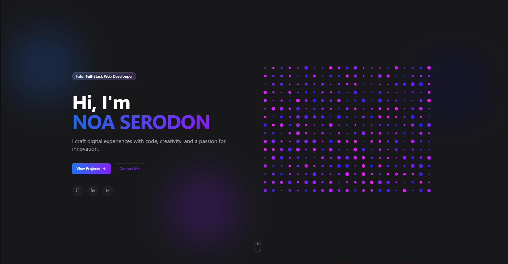

# Creative Portfolio

## Features

- Responsive design that works on all devices
- Modern UI with smooth animations
- Project showcase section
- About me section
- Contact information
- Built with cutting-edge web technologies

## Technologies Used

- [Next.js](https://nextjs.org/) - The React framework for production
- [Tailwind CSS](https://tailwindcss.com/) - Utility-first CSS framework
- [Vercel](https://vercel.com) - Deployment platform

## Getting Started

To run this project locally, follow these steps:

1. Clone the repository:
   \`\`\`bash
   git clone https://github.com/noasrdn/link.git
   \`\`\`

2. Navigate to the project directory:
   \`\`\`bash
   cd Creative-Portfolio
   \`\`\`

3. Install dependencies:
   \`\`\`bash
   npm install
   \`\`\`

4. Run the development server:
   \`\`\`bash
   npm run dev
   \`\`\`

5. Open [http://localhost:3000](http://localhost:3000) in your browser to view the portfolio.

git add . : Pour préparer tous les changements dans la zone de staging (zone de transit avant le commit).

git commit -m "Mon message explicatif" : Pour enregistrer vos changements de manière permanente dans l'historique local.

git push : Pour envoyer vos commits locaux vers le dépôt distant (GitHub, GitLab, etc.).
